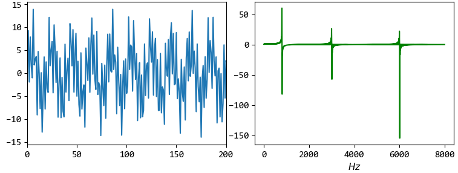

Discrete Cosine Transform
=========================

DCT全称为离散余弦变换，与DFT相关的一种变换，但是只使用实数。DCT具有去相关性，常用于数据或图像压缩（ `从数学的角度上来看，正交变换具有去相关性，去相关性就是把原采样点的自相关矩阵通过DCT变换，变成一个对角矩阵，而且对角线上的值是采样点自相关矩阵的特征值。这样一来，去相关后的矩阵保留了原矩阵的重要信息（特征值），而过滤到了一些不相关的量。这对后续的处理（比如量化、编码）都非常有意义，它使得矩阵变“瘦”，而关键信息不变，这样一来算是对原关键信息的一种增强，提高了后续的图像还原质量` ）。

序列 :math:`x(n)` 常用的一种形式：

..  math::
    C(0) &= DCT[x(0)] = \frac{1}{\sqrt{N}} \sum_{n=0}^{N-1} x(n) \\
    C(k) &= DCT[x(k)] = \sqrt{\frac{2}{N}} \sum_{n=0}^{N-1} x(n) cos\left( \frac{(2n+1) k \pi}{2N} \right) \\
    x(n) &= DCT^{-1}[C(k)] = \frac{1}{\sqrt{N}} C(0) + \sqrt{\frac{2}{N}} \sum_{k=0}^{N-1} C(k) cos\left( \frac{(2n+1) k \pi}{2N} \right)

其中， :math:`k, n \in [0, N-1]` 。

