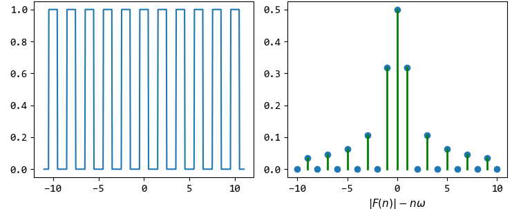
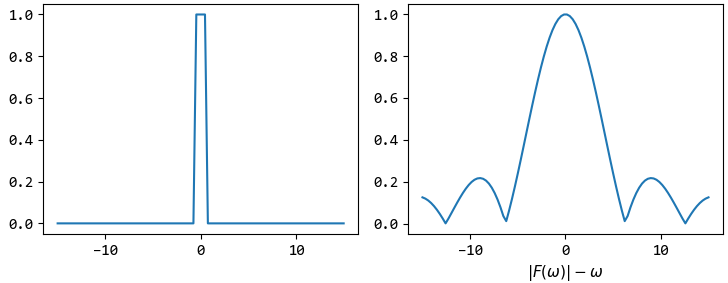
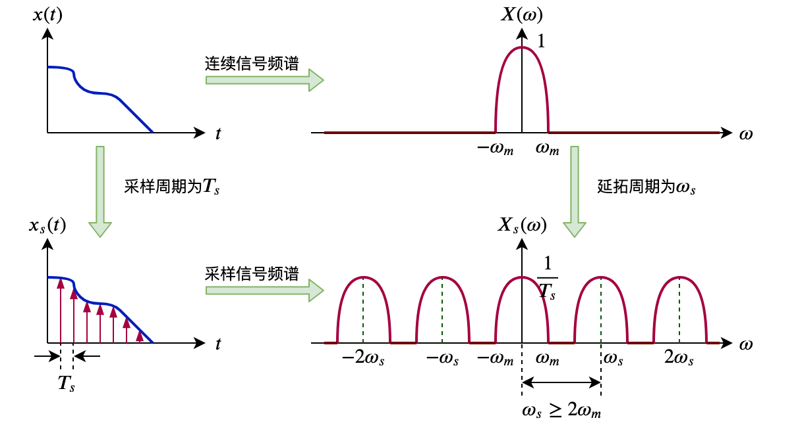
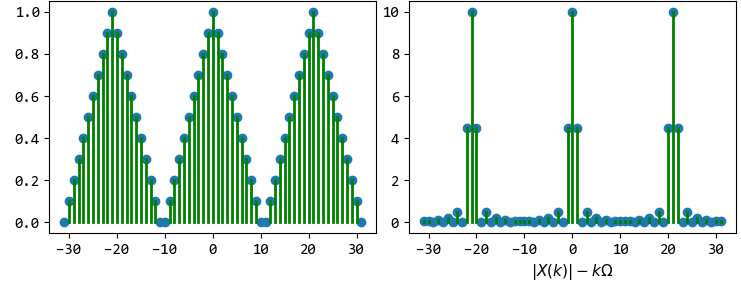
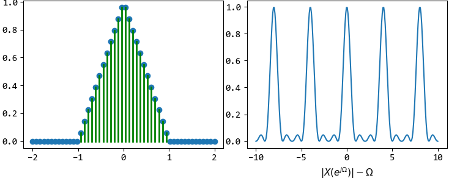
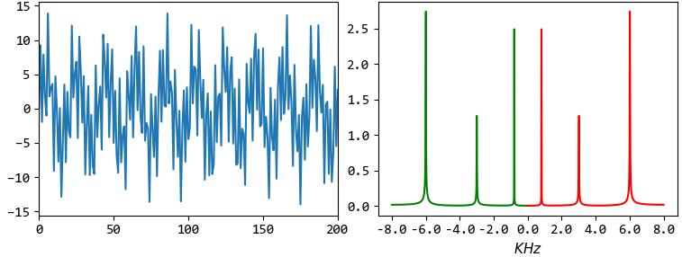

Fourier
=======

傅里叶级数(Fourier Series)
--------------------------

周期信号为：

..  math::
    y                      & = f(t) \\
    周期                   & = T \\
    角频率（基频）\omega_0 & = \frac{2 \pi}{T} \\
    频率（基频）f_0        & = \frac{1}{T} \\

三角函数形式的FS为：

..  math::
    &f(t) = a_0 + \sum_{n=1}^\infty [a_n cos(n \omega_0 t) + b_n sin(n \omega_0 t)] \\
    &a_0 = \frac{1}{T} \int_0^T f(t) dt \\
    &a_n = \frac{2}{T} \int_0^T f(t)cos(n \omega_0 t) dt \\
    &b_n = \frac{2}{T} \int_0^T f(t)sin(n \omega_0 t) dt

指数形式的FS为：

..  math::
    &f(t) = \sum_{n=-\infty}^\infty F(n \omega_0) e^{j n \omega_0 t} \\
    &F(n \omega_0) = F(n) = \frac{1}{T} \int_0^T f(t) e^{-j n \omega_0 t} dt

两种形式之间有：

..  math::
    |F(n)| = \frac{1}{2} \sqrt{a_n^2 + b_n^2}

FS用于连续周期信号。
连续周期信号级数的系数关于角频率的关系为频谱，频谱为离散非周期信号。

博里叶变换(Fourier Transform)
-----------------------------

当连续周期信号的周期趋于无穷大时，即变为连续非周期信号。
对于频谱，当 :math:`T \to \infty` 时，则谱线间的距离 :math:`\frac{2 \pi}{T} \to 0` ，即频谱变成连续信号。

连续非周期信号的频谱也是非周期连续信号。

..  math::
    正变换 \quad &F(\omega) = FT[f(t)] = \int_{-\infty}^{\infty} f(t) e^{-j \omega t} dt \\
    逆变换 \quad &f(t) = FT^{-1}[F(\omega)] = \frac{1}{2 \pi} \int_{-\infty}^{\infty} F(\omega) e^{j \omega t} d \omega \\
    其中 \quad &F(\omega)称为频谱密度函数

采样定理(Sample)
----------------

单位脉冲函数为：

..  math::
    \delta (t) =
    \begin{cases}
    0, t \neq 0 \\
    \infty, t = 0
    \end{cases}
    \quad 且 \int_{-\infty}^{\infty} \delta (t) dt = 1

脉冲函数为（理想）：

..  math::
    \delta_{T_s}(t) = \sum_{n=-\infty}^{\infty} \delta(t - nT_s)

设采样周期为 :math:`T_s` ，对连续信号采样即是与脉冲函数相乘，则理想采样信号为（仍是连续信号）：

..  math::
    x_s(t) = x(t)\delta_{T_s}(t)

根据FT卷积性质，时域相乘的结果即是频率卷积，而与脉冲函数的卷积即是在每个脉冲位置产生一个镜像，所以理想采样信号的频谱为：

..  math::
    X_s(\omega) &= \frac{1}{2 \pi} X(\omega) * \Delta_{T_s}(\omega) \\
                &= \frac{1}{T_s} \sum_{n=-\infty}^{\infty} X(\omega - n \omega_s) \\
    其中 \omega_s &= \frac{2 \pi}{T_s}

可知：理想采样信号的频谱是连续信号频谱的周期延拓，延拓周期为 :math:`\omega_s` ，幅值为 :math:`\frac{1}{T_s}` 倍。

当采样频率大于信号最大频率 :math:`\omega_m` 的两倍时，可以从采样信号准确地恢复原信号（取一个频谱周期进行傅里叶逆变换）。

离散傅里叶级数(Discrete Time Fourier Series)
--------------------------------------------

连续周期信号经采样变成离散周期信号：

..  math::
    y                        & = x(n) \\
    数字频率（基频）\Omega_0 & = \omega_0 T_s \\
    数字（最小）周期N        & = \frac{2 \pi}{\Omega_0}

离散周期信号（周期序列）的频谱也是周期离散信号，且频谱周期为 :math:`2 \pi` 。

DFS公式如下：

..  math::
    X(k \Omega_0) &= X(k) = DFS[x(n)] = \sum_{n=0}^{N-1} x(n) e^{-j k \Omega_0 n} \\
    x(n) &= DFS^{-1}[X(k \Omega_0)] = \frac{1}{N} \sum_{k=0}^{N-1} X(k \Omega_0) e^{j k \Omega_0 n}

离散时间傅里叶变换(Discrete Time Fourier Transform)
---------------------------------------------------

当离散周期信号的周期趋于无穷大时，即变为离散非周期信号。
离散非周期信号的频谱为周期连续信号。

DTFT公式如下：

..  math::
    X(e^{j\Omega}) &= DTFT[x(n)] = \sum_{n=-\infty}^{\infty} x(n) e^{-j \Omega n} \\
    x(n) &=  DTFT^{-1}[X(e^{j\Omega})] = \frac{1}{2 \pi} \int_0^{2 \pi} X(e^{j\Omega}) e^{j \Omega n} d \Omega

:时域和域频关系:

+-----------------+-----------------+-----------+--------------------------------------------------------------------------------------------+
| **时域      .** | **频域      .** | **公式.** |                                                                                            |
+=================+=================+===========+============================================================================================+
| 连续-周期       | 非周期-离散     | ``FS``    | - :math:`f(t) = \sum_{n=-\infty}^\infty F(n \omega_0) e^{j n \omega_0 t}\\[2ex]`           |
|                 |                 |           | - :math:`F(n \omega_0) = F(n) = \frac{1}{T} \int_0^T f(t) e^{-j n \omega_0 t} dt`          |
+-----------------+-----------------+-----------+--------------------------------------------------------------------------------------------+
| 连续-非周期     | 非周期-连续     | ``FT``    | - :math:`F(\omega) = \int_{-\infty}^{\infty} f(t) e^{-j \omega t} dt \\[2ex]`              |
|                 |                 |           | - :math:`f(t) = \frac{1}{2 \pi} \int_{-\infty}^{\infty} F(\omega) e^{j \omega t} d \omega` |
+-----------------+-----------------+-----------+--------------------------------------------------------------------------------------------+
| 离散-周期       | 周期-离散       | ``DFS``   | - :math:`X(k \Omega_0) = \sum_{n=0}^{N-1} x(n) e^{-j k \Omega_0 n} \\[2ex]`                |
|                 |                 |           | - :math:`x(n) = \frac{1}{N} \sum_{k=0}^{N-1} X(k \Omega_0) e^{j k \Omega_0 n}`             |
+-----------------+-----------------+-----------+--------------------------------------------------------------------------------------------+
| 离散-非周期     | 周期-连续       | ``DTFT``  | - :math:`X(e^{j\Omega}) = \sum_{n=-\infty}^{\infty} x(n) e^{-j \Omega n} \\[2ex]`          |
|                 |                 |           | - :math:`x(n) = \frac{1}{2 \pi} \int_0^{2 \pi} X(e^{j\Omega}) e^{j \Omega n} d \Omega`     |
+-----------------+-----------------+-----------+--------------------------------------------------------------------------------------------+

----

离散傅里叶变换(Discrete Fourier Transform)
------------------------------------------

用计算机进行傅里叶变换运行时，需要时域和频域的信号均是离散且有限的。

DFT是DFS时域和频率的主值周期；DFT是对DTFT的频域采样。

设置有限序列 :math:`x(n)` 的长度为 :math:`M` ，则 :math:`N` 点（ :math:`N \ge M` ）DFT公式如下：

..  math::
    W_N &= e^{-j \frac{2 \pi}{N}} \\
    X(k) &= DFT[x(n)] = \sum_{n=0}^{N-1} x(n) W_N^{nk} \\
    x(n) &= DFT^{-1}[X(k)] = \frac{1}{N} \sum_{k=0}^{N-1} X(k) W_N^{-nk}

帕塞瓦尔定理(Parseval's theorem)，即总能量为：

..  math::
    \sum_{n=0}^{N-1} |x(n)|^2 = \frac{1}{N} \sum_{n=0}^{N-1} |X(k)|^2

快速傅里叶变换(Fast Fourier Transform)
--------------------------------------

FFT是DFT一种快速计算方法，并不是新的变换算法。

FFT的基本思想，是将一个长度列递归分解成两个短序列，利用指数因子 :math:`W_N` 的周期性和对称性等性质，加速DFT计算。常用方法是 `基2时分法` 和 `基2频分法` 。

基2时分法采用递归计算：

- 正变换递归计算式：

..  math::
    \begin{cases}
    X(k) &= X_1(k) + W_N^k X_2(k) \\
    X(k + \frac{N}{2}) &= X_1(k) - W_N^k X_2(k) \\
    \end{cases}

其中 :math:`X_1(k)` 为频谱偶数下标序列， :math:`X_2(k)` 为频谱奇数下标序列，每一次递归，DFT的变换长度就小一半，最终的递归基是求单点序列的DFT（即有 :math:`X(0)=x(0)` ）。

- 逆变换递归计算式：

..  math::
    \begin{cases}
    x(n) &= x_1(n) + W_N^{-n} x_2(n) \\
    x(n + \frac{N}{2}) &= x_1(n) - W_N^{-n} x_2(n) \\
    \end{cases}

其中 :math:`x_1(n)` 为偶数下标序列， :math:`x_2(n)` 为奇数下标序列，每一次递归，DFT的逆变换长度就小一半，最终的递归基是求单点序列的IDFT（即有 :math:`x(0)=X(0)` ）。

如下图是FFT的频谱（已经进行了左右shift）：

根据采样定理，采样频率 :math:`f` 必须 :math:`>=` 原信号最高频率的2倍；
所以采样信号号经过DFT后，能看到的最高频率为 :math:`\frac{f}{2}` (即只能保留原信号 :math:`\frac{f}{2}` 频率的信息)；
固而频谱图中横坐标的范围为 :math:`[-\frac{f}{2}, \frac{f}{2}]` ，且频谱是对称的，一般用一半（如图中红线部分）就可以。

:参考:

- `傅里叶级数 <https://zh.wikipedia.org/wiki/%E5%82%85%E9%87%8C%E5%8F%B6%E7%BA%A7%E6%95%B0>`_
- `傅里叶变换 <https://zh.wikipedia.org/wiki/%E5%82%85%E9%87%8C%E5%8F%B6%E5%8F%98%E6%8D%A2>`_
- `一幅图弄清DFT与DTFT,DFS的关系 <https://www.cnblogs.com/BitArt/archive/2012/11/24/2786390.html>`_
