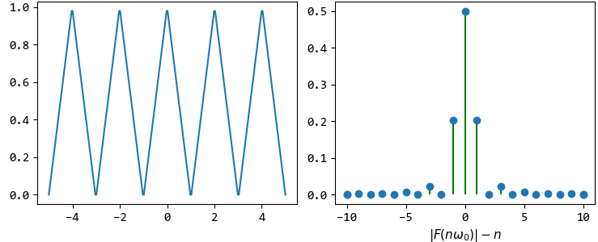
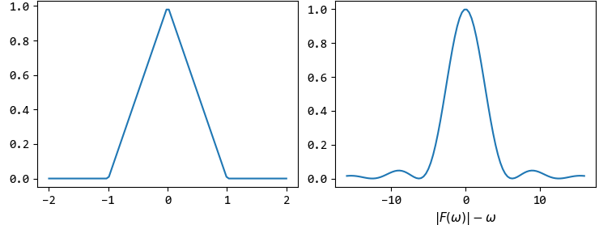

Fourier
=======

傅里叶级数(Fourier Series)
--------------------------

周期信号为：

..  math::
    y            & = f(t) \\
    周期         & = T \\
    解频率\omega & = \frac{2 \pi}{T} \\
    频率f        & = \frac{1}{T} \\

三角函数形式的FS为：

..  math::
    &f(t) = a_0 + \sum_{n=1}^\infty [a_n cos(n \omega t) + b_n sin(n \omega t)] \\
    &a_0 = \frac{1}{T} \int_0^T f(t) dt \\
    &a_n = \frac{2}{T} \int_0^T f(t)cos(n \omega t) dt \\
    &b_n = \frac{2}{T} \int_0^T f(t)sin(n \omega t) dt

指数形式的FS为：

..  math::
    &f(t) = \sum_{n=-\infty}^\infty F(n \omega) e^{j n \omega t} \\
    &F(n \omega) = F(n) = \frac{1}{T} \int_0^T f(t) e^{-j n \omega t} dt

两种形式之间有：

..  math::
    |F(n)| = \frac{1}{2} \sqrt{a_n^2 + b_n^2}

FS用于连续周期信号。
连续周期信号级数的系数关于角频率的关系为频谱，频谱为离散非周期信号。

博里叶变换(Fourier Transform)
-----------------------------

当连续周期信号的周期趋于无穷大时，即变为连续非周期信号。
对于频谱，当 :math:`T \to \infty` 时，则谱线间的距离 :math:`\frac{2 \pi}{T} \to 0` ，即频谱变成连续信号。

连续非周期信号的频谱也是非周期连续信号。

..  math::
    正变换 \quad &F(\omega) = FT[f(t)] = \int_{-\infty}^{\infty} f(t) e^{-j \omega t} dt \\
    逆变换 \quad &f(t) = FT^{-1}[F(\omega)] = \frac{1}{2 \pi} \int_{-\infty}^{\infty} F(\omega) e^{j \omega t} d \omega \\
    其中 \quad &F(\omega)称为频谱密度函数

采样定理(Sample)
----------------

单位脉冲函数为：

..  math::
    \delta (t) =
    \begin{cases}
    0, t \neq 0 \\
    \infty, t = 0
    \end{cases}
    \quad 且 \int_{-\infty}^{\infty} \delta (t) dt = 1

理想脉冲载波为：

..  math::
    \delta_{T_s}(t) = \sum_{n=-\infty}^{\infty} \delta(t - nT_s)

设采样周期为 :math:`T_s` ，则理想采样信号为（仍是连续信号）：

..  math::
    x_s(t) = x(t)\delta_{T_s}(t)

根据FT的频域卷积，理想采样信号的频谱为：

..  math::
    X_s(\omega) &= \frac{1}{2 \pi} X(\omega) * \Delta_{T_s}(\omega) \\
                &= \frac{1}{T_s} \sum_{n=-\infty}^{\infty} X(\omega - n \omega_s) \\
    其中 \omega_s &= \frac{2 \pi}{T_s}

可知：理想采样信号的频谱是连续信号频谱的周期延拓，延拓周期为 :math:`\omega_s` ，幅值为 :math:`\frac{1}{T_s}` 倍。

..  image:: fourier/sample.png
    :align: center

当采样频率大于信号最大频率 :math:`\omega_m` 的两倍时，可以从采样信号准确地恢复原信号（取一个频谱周期进行傅里叶逆变换）。

连续信号经采样变成离散周期信号有：

..  math::
    y                 & = f(t) \\
    周期              & = T \\
    解频率\omega      & = \frac{2 \pi}{T} \\
    数字频率\Omega    & = \omega T_s \\
    数字（最小）周期N & = \frac{2 \pi}{\Omega}

离散傅里叶级数(Discrete Time Fourier Series)
--------------------------------------------

离散周期信号（周期序列）的频谱也是周期离散信号，且频谱周期为 :math:`2 \pi` 。

DFS公式如下：

..  math::
    W_N^{kn} &= e^{-j \frac{2 \pi}{N} k n} \\
    X(k \Omega) &= X(k) = DFS[x(n)] = \sum_{n=0}^{N-1} x(n) W_N^{nk} \\
    x(n) &= DFS^{-1}[X(k \Omega)] = \frac{1}{N} \sum_{k=0}^{N-1} X(k  \Omega) W_N^{-nk}

..  image:: fourier/Discrete_Fourier_Series.png
    :align: center

离散时间傅里叶变换(Discrete Time Fourier Transform)
---------------------------------------------------

当离散周期信号的周期趋于无穷大时，即变为离散非周期信号。
离散非周期信号的频谱为周期连续信号。

DTFT公式如下：

..  math::
    X(e^{j\Omega}) &= DTFT[x(n)] = \sum_{n=-\infty}^{\infty} x(n) e^{-j \Omega n} \\
    x(n) &=  DTFT^{-1}[X(e^{j\Omega})] = \frac{1}{2 \pi} \int_0^{2 \pi} X(e^{j\Omega}) e^{j \Omega n} d \Omega

..  image:: fourier/Discrete_Time_Fourier_Transform.png
    :align: center

:时域和域频关系:

+-------------+-------------+--------------------------------------------------------------------------------------------+
| 时域        | 频域        | 公式                                                                                       |
+=============+=============+============================================================================================+
| 连续-周期   | 非周期-离散 | ``FS``                                                                                     |
|             |             |                                                                                            |
|             |             | - :math:`f(t) = \sum_{n=-\infty}^\infty F(n \omega) e^{j n \omega t}\\[2ex]`               |
|             |             | - :math:`F(n \omega) = F(n) = \frac{1}{T} \int_0^T f(t) e^{-j n \omega t} dt`              |
+-------------+-------------+--------------------------------------------------------------------------------------------+
| 连续-非周期 | 非周期-连续 | ``FT``                                                                                     |
|             |             |                                                                                            |
|             |             | - :math:`F(\omega) = \int_{-\infty}^{\infty} f(t) e^{-j \omega t} dt \\[2ex]`              |
|             |             | - :math:`f(t) = \frac{1}{2 \pi} \int_{-\infty}^{\infty} F(\omega) e^{j \omega t} d \omega` |
+-------------+-------------+--------------------------------------------------------------------------------------------+
| 离散-周期   | 周期-离散   | ``DFS``                                                                                    |
|             |             |                                                                                            |
|             |             | - :math:`W_N^{kn} = e^{-j \frac{2 \pi}{N} k n} \\[2ex]`                                    |
|             |             | - :math:`X(k  \Omega) = \sum_{n=0}^{N-1} x(n) W_N^{nk} \\[2ex]`                            |
|             |             | - :math:`x(n) = \frac{1}{N} \sum_{k=0}^{N-1} X(k \Omega) W_N^{-nk}`                        |
+-------------+-------------+--------------------------------------------------------------------------------------------+
| 离散-非周期 | 周期-连续   | ``DTFT``                                                                                   |
|             |             |                                                                                            |
|             |             | - :math:`X(e^{j\Omega}) = \sum_{n=-\infty}^{\infty} x(n) e^{-j \Omega n} \\[2ex]`          |
|             |             | - :math:`x(n) = \frac{1}{2 \pi} \int_0^{2 \pi} X(e^{j\Omega}) e^{j \Omega n} d \Omega`     |
+-------------+-------------+--------------------------------------------------------------------------------------------+

----

离散傅里叶变换(Discrete Fourier Transform)
------------------------------------------

快速傅里叶变换(Fast Fourier Transform)
--------------------------------------

..  根据采样定理：采样频率f必须 >= 原信号最高频率的 二倍
    也即：采样信号号经过DFT后，能还原的最高频率为f / 2
    所以：频谱图中横坐标的范围为[-f/2, f/2]，且频谱是对称的，一般用正频段就可以
    FFT结果任意一点的频率为：假设信号采样频率为f，从采样定理可以知道，信号抽样后，抽样信号的频谱是周期谱，其频谱的周期是抽样频率f，因此，对信号做FFT时，无论你取多少点，其分析的频率范围就是0~f，所以，如果你做N点的FFT（其实是离散傅里叶变换），则，FFT结果的两点之间的频率间隔是f/N，这样，任一点k（k=0~N-1)代表的频率就是k*f/N。另外，这N个点的FFT值是以N/2为对称的，所以，一般真正用到的只有N/2个点。N点取的大只说明谱线密一些而已，注意：采样定理非常重要啊！

:参考:

- `傅里叶级数 <https://zh.wikipedia.org/wiki/%E5%82%85%E9%87%8C%E5%8F%B6%E7%BA%A7%E6%95%B0>`_
- `傅里叶变换 <https://zh.wikipedia.org/wiki/%E5%82%85%E9%87%8C%E5%8F%B6%E5%8F%98%E6%8D%A2>`_

----

API
---

..  automodule:: fourier
    :members:
