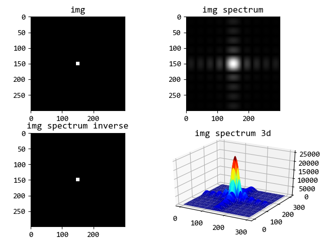

2D-DFT
======

设置有限二维序列 :math:`f(x,y)` 的大小为 :math:`M \times N` ，则二维DFT公式如下：

..  math::
    F(u, v) = DFT[f(x, y)] &= \sum_{x=0}^{M-1}
                              \sum_{y=0}^{N-1} f(x, y)
                              e^{-j2\pi \left( \frac{ux}{M} + \frac{vy}{N} \right)} \\
                           &= \sum_{x=0}^{M-1}
                              \left[
                                   \sum_{y=0}^{N-1} f(x, y) e^{-j2\pi \left(\frac{vy}{N} \right)}
                              \right]
                              e^{-j2\pi \left(\frac{ux}{M} \right)} \\
    f(x, y) = DFT^{-1}[F(u, v)] &= \frac{1}{MN} \sum_{u=0}^{M-1}
                                   \sum_{v=0}^{N-1} F(u, v) 
                                   e^{j2\pi \left( \frac{ux}{M} + \frac{vy}{N} \right)} \\
                                &= \frac{1}{M} \sum_{u=0}^{M-1}
                                   \left[
                                        \frac{1}{N} \sum_{v=0}^{N-1} F(u, v) e^{j2\pi \left(\frac{vy}{N} \right)}
                                   \right]
                                   e^{j2\pi \left(\frac{ux}{M} \right)}

由公式可以看出，二维DFT可在一维DFT基础上计算，即先按行计算DFT再按列计算DFT。

